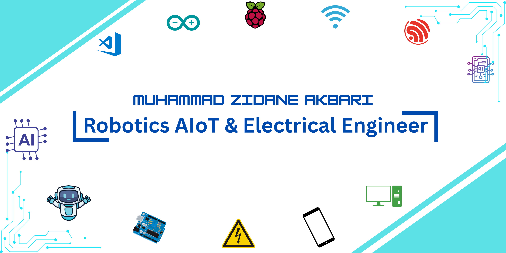

# Hello Robo-Makers!, I'm Zidane, an Indonesian Robotics AIoT & Electrical Engineer 👋🏼:
🛜 My website [webpage](https://zmc18-robotics.github.io/MyWebsiteZmc18ShopIDN/) 
👨🏼‍🎓 I study at University of Singaperbangsa Karawang - Indonesia 
👨🏼‍💻 Working as a Robotics AIoT Engineer  
🎬 My Youtube Channel: <a href="https://www.youtube.com/@Zmc18_Roboticz" target="_blank"><i>Zmc18_Roboticz</i></a>  
📸 My Instagram: <a href="https://www.instagram.com/mc.zminecrafter_18" target="_blank"><i>@mc.zminecrafter_18</i></a>

# 💻 Tech Stack :

---

## 🧑‍💻 Programming Languages

---

## 🔧 Skill & Technique

---

## 🧠 AI, Data, & Machine Learning

---

## 🤖 Embedded Systems & Robotics

---

## 🌐 IoT, Networking, & Cloud

---

## 🛠 Development Tools & Frameworks

---

## 🧩 Hardware Design & Simulation

---

## 🎨 Creative & Art

---

# 🔥 Contribution Streak

 

---

# 📚 Most Used Languages 

  

---

# 📈 GitHub Stats

  

---

# 🏆 Top Contributed Repositories 

  

---

# 💬 Developer Quote

  <strong>"Robotics is not magic — it's persistence, curiosity, and thousands of tiny improvements. ~ Zmc18 ( me )"</strong>

---

# Visitor and Forks

| Statistik | Jumlah |
|---|---|
| 👀 Total Profile Views |  |

---
# 🤖 About Me
- 🔧 Robotics Builder — Arduino, ESP32, Sensors, Motors  
- 🤖 AI & Embedded Integration  
- 🌐 IoT System Developer  
- 🧠 Loves automation, robot control, and R&D  
- 💻 Mostly coding in **Python, C++, MicroPython**  
- 🚀 Building smart robots & AI-assisted mechatronics  

---

# 📩 Contact & Socials
- 🌐 GitHub: **Zmc18-Robotics**
- 💼 More links coming soon...

---

<h3 align="center">🔥 Generated Automatically — Always Updated</h3>

<picture>
  <source media="(prefers-color-scheme: dark)" srcset="https://raw.githubusercontent.com/tobiasmeyhoefer/tobiasmeyhoefer/output/github-snake-dark.svg" />
  <source media="(prefers-color-scheme: light)" srcset="https://raw.githubusercontent.com/tobiasmeyhoefer/tobiasmeyhoefer/output/github-snake.svg" />
  
</picture>
<!--
**Zmc18-Robotics/Zmc18-Robotics** is a ✨ _special_ ✨ repository because its `README.md` (this file) appears on your GitHub profile.

Here are some ideas to get you started:

- 🔭 I’m currently working on ...
- 🌱 I’m currently learning ...
- 👯 I’m looking to collaborate on ...
- 🤔 I’m looking for help with ...
- 💬 Ask me about ...
- 📫 How to reach me: ...
- 😄 Pronouns: ...
- ⚡ Fun fact: ...
-->
