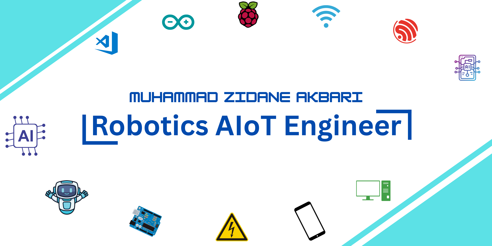

# Hi there 👋
Its me Zidane, I am a Robotics Engineer and AIoT Programmer

# Hello Robo-Makers!, I'm Zidane, an Indonesian Robotics AIoT Engineer 👋🏼:
🛜 My website [webpage](https://zmc18-robotics.github.io/MyWebsiteZmc18ShopIDN/) 👨🏼‍🎓 I study at University of Singaperbangsa Karawang - Indonesia 👨🏼‍💻 working as a Robotics AioT Engineer  🎬 My Youtube Channel <i>Zmc18_Roboticz</i> 

# 💻 Tech Stack:
                  

<picture>
  <source media="(prefers-color-scheme: dark)" srcset="https://raw.githubusercontent.com/tobiasmeyhoefer/tobiasmeyhoefer/output/github-snake-dark.svg" />
  <source media="(prefers-color-scheme: light)" srcset="https://raw.githubusercontent.com/tobiasmeyhoefer/tobiasmeyhoefer/output/github-snake.svg" />
  
</picture>
<!--
**Zmc18-Robotics/Zmc18-Robotics** is a ✨ _special_ ✨ repository because its `README.md` (this file) appears on your GitHub profile.

Here are some ideas to get you started:

- 🔭 I’m currently working on ...
- 🌱 I’m currently learning ...
- 👯 I’m looking to collaborate on ...
- 🤔 I’m looking for help with ...
- 💬 Ask me about ...
- 📫 How to reach me: ...
- 😄 Pronouns: ...
- ⚡ Fun fact: ...
-->
